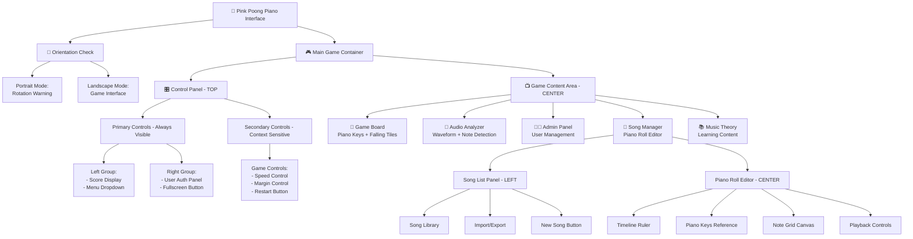
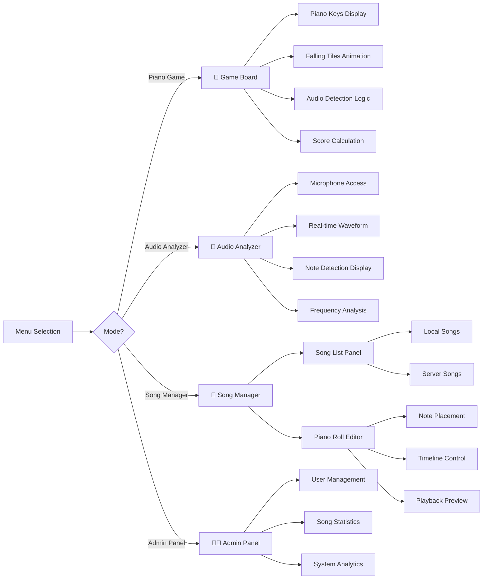
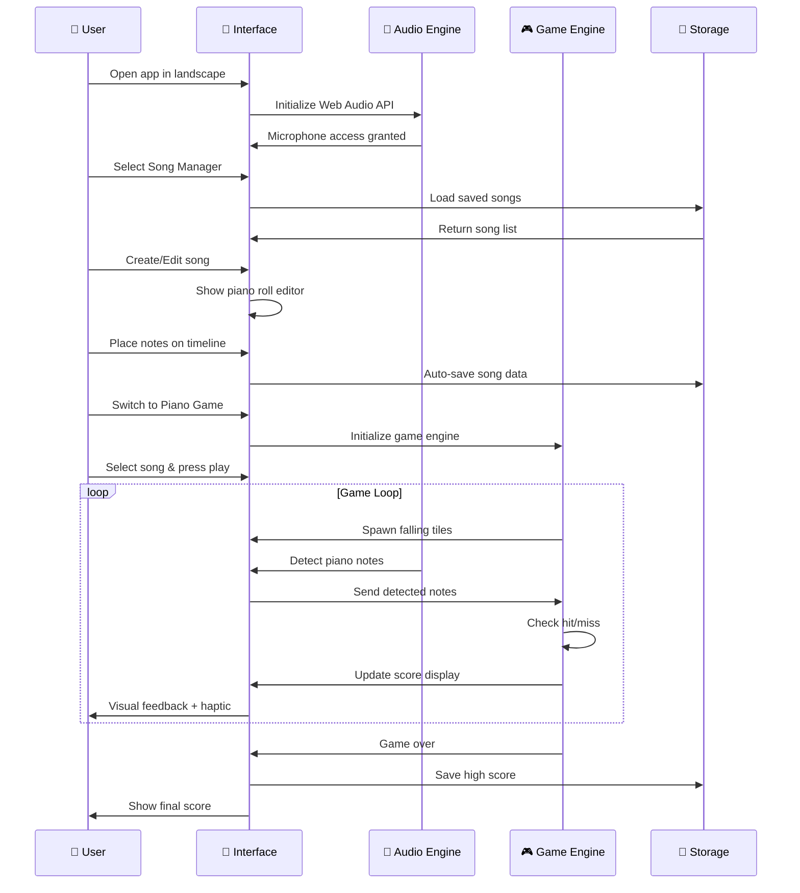
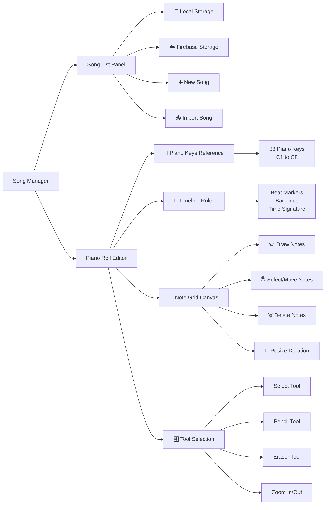

# 🎹 Pink Poong Piano - Layout Diagram & Workflow

## 📱 **Sơ đồ tổng quan giao diện**



## 🎹 **Cách thức hoạt động của giao diện Pink Poong Piano**

### **1. 📱 Kiểm tra hướng màn hình (Orientation Check)**
```
Portrait Mode → Hiển thị thông báo xoay thiết bị
Landscape Mode → Kích hoạt giao diện game
```

### **2. 🎛️ Control Panel (Thanh điều khiển trên)**

**Primary Controls (Luôn hiển thị):**
- **Score Panel**: Hiển thị điểm số real-time
- **Menu Dropdown**: Chuyển đổi giữa các chế độ
  - Piano Game (🎮)
  - Audio Analyzer (🎵) 
  - Song Manager (🎼)
  - Music Theory (📚)
  - Admin Panel (👨‍💼 - chỉ admin)
- **User Auth**: Login/Logout + avatar
- **Fullscreen Button**: Chế độ toàn màn hình

**Secondary Controls (Hiển thị theo ngữ cảnh):**
- **Speed Control**: Điều chỉnh tốc độ rơi của tiles
- **Margin Control**: Điều chỉnh vùng nhận diện âm thanh
- **Restart Button**: Khởi động lại game

### **3. 📺 Luồng chuyển đổi chế độ**



### **4. 🎮 Game Workflow (Luồng hoạt động game)**



### **5. 📱 Mobile UX Enhancements (Tối ưu di động)**

**Auto-collapsing Control Panel:**
- Tự động ẩn sau 5 giây khi chơi game
- Double-tap để hiển thị/ẩn
- Swipe up để mở rộng control panel

**Touch Gestures:**
- **Double-tap**: Toggle control panel
- **Swipe up**: Expand controls  
- **Swipe down**: Collapse controls
- **Long press**: Context menu (trong song editor)

**Haptic Feedback:**
- Rung nhẹ khi nhấn piano key
- Rung mạnh khi hit perfect
- Sử dụng Vibration API

**Performance Optimizations:**
- GPU acceleration cho animations
- Reduced motion support
- Auto-hide secondary controls
- 60fps target với requestAnimationFrame

### **6. 🎼 Song Manager Layout**



### **7. 🎯 Key Features & Interactions**

**Real-time Audio Processing:**
- Web Audio API capture âm thanh từ microphone
- FFT analysis để detect notes (C1-C8)
- Real-time visualization với waveform display

**Cross-platform Storage:**
- **Local Storage**: Lưu songs offline
- **Firebase**: Sync songs across devices + user accounts
- **Auto-save**: Tự động lưu mỗi 2 giây trong editor

**Responsive Design:**
- **Mobile-first**: Tối ưu cho landscape gaming
- **Touch-friendly**: Large buttons, gesture support
- **Progressive Enhancement**: Works without login/internet

**Game Mechanics:**
- **Physics Engine**: Falling tiles với gravity simulation
- **Collision Detection**: Precise timing windows
- **Visual Effects**: Particle systems, glow effects
- **Scoring System**: Combo multipliers, perfect hits

### **8. 📊 Performance Metrics**

```
🎯 Target: 60 FPS animations
🔊 Audio Latency: <50ms detection
💾 Storage: Local + Cloud sync
📱 Mobile: Landscape-optimized
🎮 Responsive: <100ms touch feedback
```

### **9. 🔧 Technical Architecture**

**Frontend Stack:**
- HTML5 + CSS3 + JavaScript ES6+
- Web Audio API for real-time audio processing
- Canvas API for piano roll editor
- CSS Grid + Flexbox for responsive layout

**Backend Integration:**
- Firebase Authentication
- Firestore Database
- Local Storage fallback

**Mobile Optimizations:**
- PWA capabilities
- Touch gesture recognition
- Haptic feedback support
- Auto-orientation detection

### **10. 🎵 Audio Processing Flow**

```
Microphone Input 
    ↓
Web Audio API Capture
    ↓
FFT Analysis (Real-time)
    ↓
Frequency to Note Conversion
    ↓
Note Detection & Validation
    ↓
Game Engine Integration
    ↓
Visual Feedback + Scoring
```

---

## 💡 **Tóm tắt**

Giao diện Pink Poong Piano được thiết kế như một **Progressive Web App** với focus chính là **mobile gaming experience** kết hợp **real piano interaction**. Mọi element đều được tối ưu cho việc chơi game bằng cách đặt điện thoại trên piano thật và sử dụng âm thanh để điều khiển! 🎹✨

**Key Innovation:** Thay vì tap màn hình, người dùng chơi bằng cách bấm phím piano thật, điện thoại sẽ detect âm thanh và điều khiển game tương ứng. 